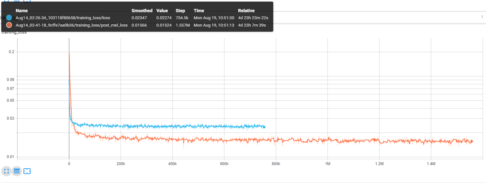
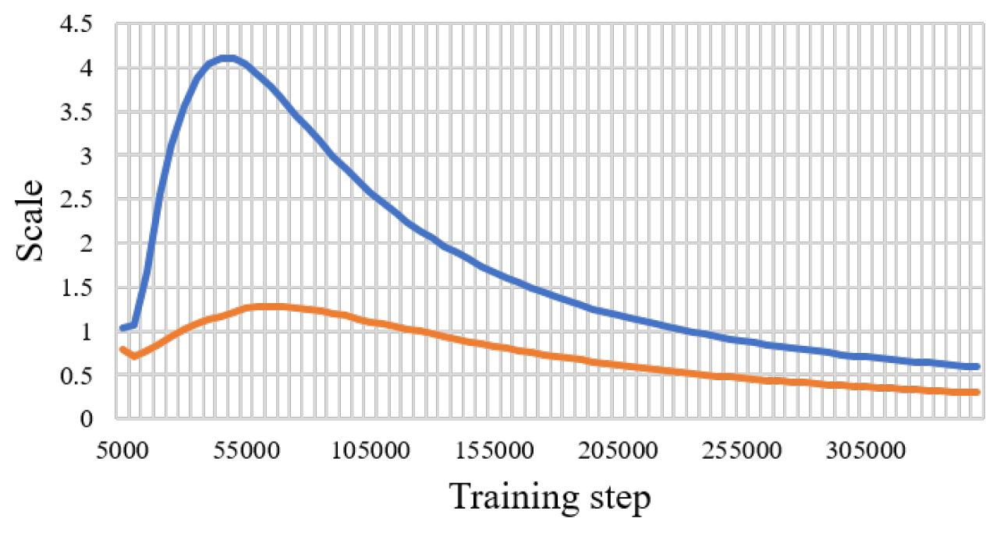
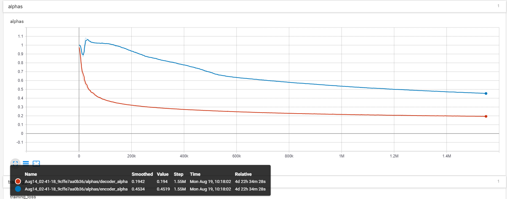

# Transformer-TTS
* A Pytorch Implementation of [Neural Speech Synthesis with Transformer Network](https://arxiv.org/abs/1809.08895)
* This model can be trained about 3 to 4 times faster than the well known seq2seq model like tacotron, and the quality of synthesized speech is almost the same. It was confirmed through experiment that it took about 0.5 second per step.
* I did not use the wavenet vocoder but learned the post network using CBHG model of tacotron and converted the spectrogram into raw wave using griffin-lim algorithm.


## Requirements
  * Install python 3
  * Install pytorch == 0.4.0
  * Install requirements:
    ```
   	pip install -r requirements.txt
   	```

## Data
* I used LJSpeech dataset which consists of pairs of text script and wav files. The complete dataset (13,100 pairs) can be downloaded [here](https://keithito.com/LJ-Speech-Dataset/). I referred https://github.com/keithito/tacotron and https://github.com/Kyubyong/dc_tts for the preprocessing code.

## Attention plots
* A diagonal alignment appeared after about 15k steps. The attention plots below are at 160k steps. Plots represent the multihead attention of all layers. In this experiment, h=4 is used for three attention layers. Therefore, 12 attention plots were drawn for each of the encoder, decoder and encoder-decoder. With the exception of the decoder, only a few multiheads showed diagonal alignment.

### Self Attention encoder
(TODO update)


### Self Attention decoder
(TODO update)


### Attention encoder-decoder
(TODO update)


## Learning curves & Alphas
* I used Noam style warmup and decay as same as [Tacotron](https://github.com/Kyubyong/tacotron)
- post_mel_loss : 0.01524 for 1.5M iter (3.6K epoch)
- text2mel loss : 0.2347 for 754K iter  (3.8K epoch)


* The alpha value for the scaled position encoding is different from the thesis. In the paper, the alpha value of the encoder and decoders  are increased to 4(encoder) and 1.2(decoder)
  

In the present experiment, the decoder alpha is slightly decrese (0.87) during 16K iterations  and it increased to (1.082) during 25K iterations and then decreased continuously. The decoder alpha has steadily decreased since the beginning.
  

## Experimental notes


## Generated Samples
* You can check some generated samples below. All samples are step at 160k, so I think the model is not converged yet. This model seems to be lower performance in long sentences.

(TODO update)
    * [sample1](https://soundcloud.com/ksrbpbmcxrzu/160k-0)
    * [sample2](https://soundcloud.com/ksrbpbmcxrzu/160k_sample_1)
    * [sample3](https://soundcloud.com/ksrbpbmcxrzu/160k_sample_2)

* The first plot is the predicted mel spectrogram, and the second is the ground truth.
(TODO update)
 


## File description
  * `hyperparams.py` includes all hyper parameters that are needed.
  * `prepare_data.py` preprocess wav files to mel, linear spectrogram and save them for faster training time. 
  * `preprocess.py` includes all preprocessing codes when you loads data. Preprocessing codes for text is in text/ directory.
  * `module.py` contains all methods, including attention, prenet, postnet and so on.
  * `network.py` contains networks including encoder, decoder and post-processing network.
  * `train_transformer.py` is for training autoregressive attention network. (text --> mel)
  * `train_postnet.py` is for training post network. (mel --> linear)
  * `synthesis.py` is for generating TTS sample.

## Training the network
  * STEP 1. Download and extract LJSpeech data at any directory you want.
            (TODO) replace hyungon's audio util(CPU) and R's util(GPU) 

  * STEP 2. Adjust hyperparameters in `hyperparams.py`, especially 'data_path' which is a directory that you extract files, and the others if necessary.
            - configure hyperparam ( hyungon's experiment) (TODO) match waveglow parameters 
            - sampling rate : 22050
            - num_mels : 80
            - n_FFT : 1024
            - windows size : 0.04644 ( same size of nFFT) 
            - hop_size : 0.01161 ( 1/4 of windows size)
            - preamp : 1 ( no preamp)
            - log_power : 2 ( for librosa default) 
  
  * STEP 3. Run `prepare_data.py`.
            -  generate Mel and Mag 
             -- for original wav : `LJSpeech-1.1\wavs\LJ001-0001.wav`
             -- it will make mag : `LJSpeech-1.1wavs\LJ001-0001.mag.npy` (TODO) sperate mag/mel directory 
             -- it will make mel : `LJSpeech-1.1\wavs\LJ001-0001.pt.npy` (TODO) sperate mag/mel directory `mel.npy` instead of `pt.npy`  
  * STEP 4. Run `preprocess.py`.
            - *make pair of audio/text* for transformer
  
  * STEP 5. Run `train_transformer.py`.
            - with Tesla V100(1GPU), with batch 64, OOM
            - with Tesla V100(1GPU), with batch 32, it needs 409 iter for single epoch
            - it will take 1min 54 sec ( 3.7 iter/s) per epoch
            - it will take 13 day, 316 hr, 1140k sec for 10K epoch 
             -- (TODO) check convergence and modify epoch 
             -- (TODO) seperate epoch for posnet and transformer
             -- (TODO) multiGPU ( apex) 
  
  
  * STEP 6. Run `train_postnet.py`.
           - *train mel to mag* to generate high fidelity audio with griffin-lim (TODO) waveglow instead of posnet 
           - with Tesla V100(1GPU), with batch 64, it needs 204 iter for single epoch
           - it will take 1min 54 sec ( 1.80 iter/s) per epoch
           - it will take 13 day, 316 hr, 1140k sec for 10K epoch 
            -- (TODO) check convergence and modify epoch 
            -- (TODO) seperate epoch for posnet and transformer
            -- (TODO) multiGPU ( apex) 


## Generate TTS wav file
  * STEP 1. Run `synthesis.py`. Make sure the restore step. 

## Reference
  * Keith ito: https://github.com/keithito/tacotron
  * Kyubyong Park: https://github.com/Kyubyong/dc_tts
  * jadore801120: https://github.com/jadore801120/attention-is-all-you-need-pytorch/

## Comments
  * Any comments for the codes are always welcome.

